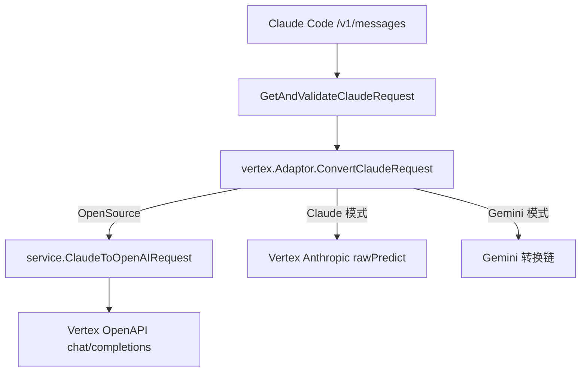

# 变更提案: fix vertex glm5 claude messages openapi compatibility

## 元信息
```yaml
类型: 修复
方案类型: implementation
优先级: P0
状态: 已确认
创建: 2026-04-14
```

---

## 1. 需求

### 背景
当前项目将 Vertex AI 中带 `-maas` 的模型识别为 OpenAI Chat Completions 上游，并把请求发送到
`.../endpoints/openapi/chat/completions`。但当客户端走 Claude Messages 协议
（例如 Claude Code 访问 `/v1/messages`）时，`relay/channel/vertex/adaptor.go`
仍然把请求包装成 Vertex Anthropic 风格的 `anthropic_version/messages/system/tools`
结构，导致 Vertex MaaS 上游返回 400。相同模型经官方 GLM OpenAI 套餐调用正常，说明问题在于
`Claude -> Vertex OpenAPI` 的请求体兼容层，而不是模型本身或计费链路。

### 目标
- 修复 Vertex OpenSource 模式下 `/v1/messages` 到 `zai-org/glm-5-maas` 的 400 问题。
- 复用仓库已有的 `Claude -> OpenAI` 转换链路，确保 `system`、`tools/tool_choice`、
  多段 content、thinking/effort 等常见能力能被一起带到 Vertex OpenAPI。
- 保持 Vertex 原生 Claude 模式和 Gemini 模式行为不变，避免扩大回归面。

### 约束条件
```yaml
时间约束: 本轮直接修复并完成最小必要回归
性能约束: 仅调整请求转换分支，不增加新的网络往返或额外序列化层
兼容性约束: 必须继续支持 Vertex service account json 凭据模式；不得影响 Vertex Claude/Gemini 现有分支
业务约束: 不修改受保护的项目标识，不改变现有计费、路由和响应格式策略
```

### 验收标准
- [ ] Claude Messages 请求在 Vertex OpenSource 模式下会被转换为 OpenAI Chat Completions 请求体，而不是 Anthropic 风格请求体。
- [ ] `system`、`tools/tool_choice`、多段文本 content、thinking/effort 等常见 Claude Messages 字段在转换后可保留到 OpenAI 请求中。
- [ ] 针对 Vertex OpenSource 新增单元测试，并通过相关 `go test` 回归。
- [ ] Vertex 原生 Claude 模式 URL/请求体和 Vertex Gemini 模式路径不受影响。

---

## 2. 方案

### 技术方案
在 `relay/channel/vertex/adaptor.go` 中为 `RequestModeOpenSource` 单独处理
`ConvertClaudeRequest`：

1. 不再复用 `copyRequest()` 生成 Vertex Anthropic 请求体。
2. 直接调用 `service.ClaudeToOpenAIRequest()` 复用现有成熟的 Claude 到 OpenAI 请求转换。
3. 将转换结果继续交给当前 Vertex OpenSource 分支发送到
   `.../endpoints/openapi/chat/completions`。
4. 保持 `RequestModeClaude` 继续走 `rawPredict/streamRawPredict`，`RequestModeGemini` 继续走 Gemini 逻辑。
5. 通过单元测试验证 OpenSource 模式下的 payload 结构，以及 Claude/Gemini 模式未被误伤。

### 影响范围
```yaml
涉及模块:
  - relay/channel/vertex: 修正 Vertex OpenSource 的 Claude Messages 请求转换逻辑
  - service: 复用现有 ClaudeToOpenAIRequest 转换能力，无需新增分支逻辑
  - tests: 增加 Vertex OpenSource 请求转换回归测试
预计变更文件: 2-3
```

### 风险评估
| 风险 | 等级 | 应对 |
|------|------|------|
| OpenSource 分支修复时误伤 Vertex Claude 原生模型 | 中 | 只在 `RequestModeOpenSource` 下切换逻辑，并补充模式隔离测试 |
| Claude 转 OpenAI 后部分字段丢失 | 中 | 直接复用 `service.ClaudeToOpenAIRequest`，并对 system/tools/thinking 写断言 |
| 流式兼容仅修了请求体，未覆盖响应侧 | 低 | 响应侧已有 Vertex OpenAPI 兼容逻辑，本次保留并以流式请求测试覆盖入口 |

---

## 3. 技术设计（可选）

### 架构设计


### API设计
#### POST /v1/messages
- **请求**: Claude Messages 协议请求体
- **响应**: 保持现有路由格式，由 Vertex OpenSource 上游返回 OpenAI 风格响应，再由系统按客户端格式转换

### 数据模型
本次不新增持久化模型，也不调整数据库结构。

---

## 4. 核心场景

> 执行完成后同步到对应模块文档

### 场景: Claude Code 通过 Vertex MaaS 调用 GLM-5
**模块**: `relay/channel/vertex`
**条件**: 渠道为 Vertex AI，模型为 `zai-org/glm-5-maas` 一类 OpenSource MaaS 模型，客户端走 `/v1/messages`
**行为**: 系统将 Claude Messages 请求转换为 OpenAI Chat Completions 请求并发送至 Vertex OpenAPI 端点
**结果**: 上游不再因 payload schema 不匹配返回 400，文本与流式请求都能正常完成

### 场景: Vertex 原生 Claude 模型继续走 Anthropic 分支
**模块**: `relay/channel/vertex`
**条件**: 模型前缀仍是 `claude`
**行为**: 系统继续生成 Vertex Anthropic `rawPredict/streamRawPredict` 请求
**结果**: 现有 Claude on Vertex 行为保持不变

---

## 5. 技术决策

> 本方案涉及的技术决策，归档后成为决策的唯一完整记录

### fix vertex glm5 claude messages openapi compatibility#D001: OpenSource Vertex 复用通用 Claude 到 OpenAI 转换链
**日期**: 2026-04-14
**状态**: ✅采纳
**背景**: Vertex `-maas` 模型实际走 OpenAPI `chat/completions`，而当前 `/v1/messages`
请求仍被包装为 Anthropic payload，导致 schema 不兼容。需要决定是补一个 Vertex 专用映射，
还是复用仓库已经验证过的 Claude->OpenAI 转换链。
**选项分析**:
| 选项 | 优点 | 缺点 |
|------|------|------|
| A: 在 Vertex 适配层单独维护一套 Claude->OpenAI 映射 | 可完全按 Vertex 特性定制 | 与现有转换链重复，后续字段漂移风险高 |
| B: 复用 `service.ClaudeToOpenAIRequest` 后再走 Vertex OpenSource 请求路径 | 复用已有兼容逻辑，覆盖 system/tools/thinking，多数行为已有先例 | 需要明确只在 OpenSource 模式启用，避免影响原生 Claude 分支 |
**决策**: 选择方案 B
**理由**: 当前问题的根因是错误的上游协议选择，而不是缺少字段级适配。复用现有转换链可以最小修改修复问题，并天然继承系统、工具、多段内容、thinking 等已支持能力。
**影响**: 影响 `relay/channel/vertex` 的请求转换分支和对应单元测试，不涉及数据库、前端和计费结构

---

## 6. 成果设计

> 含视觉产出的任务由 DESIGN Phase2 填充。非视觉任务整节标注"N/A"。

N/A
