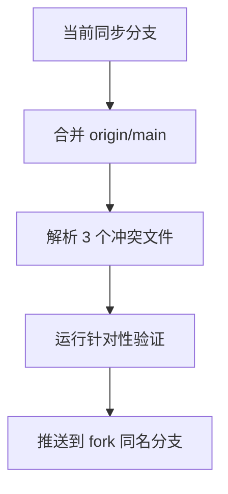

# 变更提案: sync-fork-with-upstream-preserving-local-changes

## 元信息
```yaml
类型: 优化
方案类型: implementation
优先级: P0
状态: 已确认
创建: 2026-04-14
```

---

## 1. 需求

### 背景
当前仓库的 `origin` 指向源仓库 `QuantumNous/new-api`，`fork` 指向用户自己的 fork `Micah123321/new-api`。源仓库近期已经新增大量提交，而 fork 当前实际头部与同步工作分支一致，落后最新 `origin/main` 171 个提交，同时保留了 9 个 fork 定制提交。如果直接重置到上游，会丢失 fork 上的兼容性修复和 CI 定制；如果直接在 `fork/main` 上盲目 rebase，风险较高且回退成本大。

### 目标
- 在当前同步分支 `sync/origin-main-with-local7-20260318` 上合并最新 `origin/main`
- 保留 fork 的 9 个定制提交语义，尤其是 GHCR/工作流定制和 relay 兼容性修复
- 将结果整理为可验证、可推送到 `fork` 同名分支的状态

### 约束条件
```yaml
时间约束: 无硬性时限，优先保证合并正确性和可回退性
性能约束: 不适用
兼容性约束:
  - 不破坏项目受保护标识 new-api / QuantumNous
  - 保持 Go 后端和 GitHub Actions 工作流可继续使用
业务约束:
  - 不重写 fork 现有远端历史
  - 不删除用户在 fork 上已有的定制逻辑
```

### 验收标准
- [ ] 当前分支成功并入最新 `origin/main`，不丢失 fork 的 9 个本地提交语义
- [ ] 预检冲突文件 [`.github/workflows/docker-image-alpha.yml`](/E:/code/go/new-api/.github/workflows/docker-image-alpha.yml)、[`.github/workflows/docker-image-arm64.yml`](/E:/code/go/new-api/.github/workflows/docker-image-arm64.yml)、[`relay/compatible_handler.go`](/E:/code/go/new-api/relay/compatible_handler.go) 完成解析
- [ ] 至少完成针对性验证，确认 Go 相关测试/构建与 YAML 文件状态无明显阻断
- [ ] 工作树处于可审阅、可推送状态，并明确后续推送目标为 `fork/sync/origin-main-with-local7-20260318`

---

## 2. 方案

### 技术方案
采用非破坏性同步路径：

1. 基于当前同步分支保留 fork 定制历史，不在执行前重置或强推。
2. 将最新 `origin/main` 直接合并到当前分支，而不是对 9 个本地提交做长链 rebase。
3. 仅对真实冲突文件进行逐文件解析，优先保留 fork 的 GHCR/部署策略与 relay 兼容性修复，再吸收上游的安全与结构更新。
4. 合并完成后运行针对性验证，确认 relay 相关逻辑和工作流文件没有明显回归。
5. 最终保留本地结果并准备推送到 `fork` 同名同步分支，由用户决定是否再合并到 `fork/main`。

### 影响范围
```yaml
涉及模块:
  - .github/workflows: fork 的镜像发布策略与上游工作流强化合并
  - relay: OpenAI/Responses 兼容处理逻辑与上游主线对齐
  - .helloagents/plan: 记录本次同步任务的设计与执行状态
预计变更文件: 6-10
```

### 风险评估
| 风险 | 等级 | 应对 |
|------|------|------|
| 上游 171 个提交引入的行为变化与本地兼容补丁发生逻辑冲突 | 高 | 先做只读冲突预检，实际合并时逐文件比对并做定向验证 |
| GitHub Actions 工作流同时被上游和 fork 修改，容易误删 fork 的发布策略 | 高 | 对 CI 文件保留 fork 的 GHCR 目标和必要定制，同时吸收上游安全强化 |
| relay 兼容处理文件冲突后行为回归 | 高 | 合并后运行相关 Go 测试，必要时补充最小验证 |
| 本地同步结果只推到同步分支，尚未进入 fork/main | 中 | 在交付结果中明确分支状态和后续推送建议 |

---

## 3. 技术设计（可选）

> 涉及架构变更、API设计、数据模型变更时填写

### 架构设计


### API设计
N/A，本任务不新增外部 API。

### 数据模型
| 字段 | 类型 | 说明 |
|------|------|------|
| N/A | N/A | 本任务不涉及数据模型变更 |

---

## 4. 核心场景

> 执行完成后同步到对应模块文档

### 场景: fork 同步上游但保留本地定制
**模块**: Git 分支 / CI 工作流 / relay
**条件**: 当前分支为 `sync/origin-main-with-local7-20260318`，`origin/main` 已抓取到最新提交
**行为**: 在当前同步分支合并上游主线，并逐项解析冲突文件，保留 fork 的必要定制
**结果**: 当前同步分支既包含最新上游提交，也继续保留 fork 的现有兼容修复和发布策略

---

## 5. 技术决策

> 本方案涉及的技术决策，归档后成为决策的唯一完整记录

### sync-fork-with-upstream-preserving-local-changes#D001: 使用 merge 同步上游而非重写 fork 历史
**日期**: 2026-04-14
**状态**: ✅采纳
**背景**: 当前同步分支相对最新 `origin/main` 为 `behind 171 / ahead 9`。fork 的 9 个提交跨越 CI 工作流和 relay 兼容逻辑，若采用长链 rebase，会放大冲突面并提高回滚成本。
**选项分析**:
| 选项 | 优点 | 缺点 |
|------|------|------|
| A: 在当前同步分支 merge `origin/main` | 非破坏性，保留 fork 提交语义，便于按文件解析冲突 | 会产生合并提交，历史不如 rebase 线性 |
| B: 将 9 个本地提交 rebase 到最新 `origin/main` | 历史更线性 | 冲突链更长，失败时恢复成本更高，且更容易误伤 fork 定制 |
**决策**: 选择方案 A
**理由**: 这次任务的首要目标是“保留 fork 变更并吸收上游更新”，merge 更符合保守修改和可回退原则。
**影响**: 影响当前同步分支的历史形态、冲突解决方式，以及后续推送策略

---

## 6. 成果设计

> 含视觉产出的任务由 DESIGN Phase2 填充。非视觉任务整节标注"N/A"。

### 设计方向
- N/A

### 视觉要素
- N/A

### 技术约束
- **可访问性**: N/A
- **响应式**: N/A
